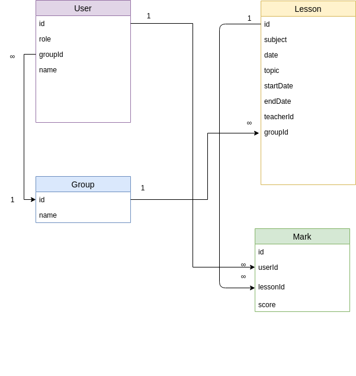

# men

create a db structure.

children garden.

- kids.

- teachers.

- parents.

- scores.

Every day children got marks of achievements. good or bad.

Parent would like to know the schedule and achievements and what teacher was assigned.

Draw how to organize mongodb and SQL.

#TODO:

1. create relationship table
2. Create admin page. Implement CRUD for Lessons, Groups, Marks
